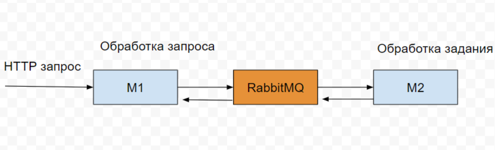

# RabbitMQ NodeJS

Schema:


Local Deployment:

1. You can change .env file

2. Coping .env

```bash
mv .env.example .env
cp .env ./producer
cp .env ./consumer
```

3. Deploy Docker:

```bash
docker compose up -d
```

4. Run servers:

```bash
cd producer
npm install
npm start
```

```bash
cd consumer
npm install
npm start
```

5. Test:
```bash
curl -X POST http://localhost:3000 -H "Content-Type: application/json" -d '{"message": "asdasdasd"}'
```
